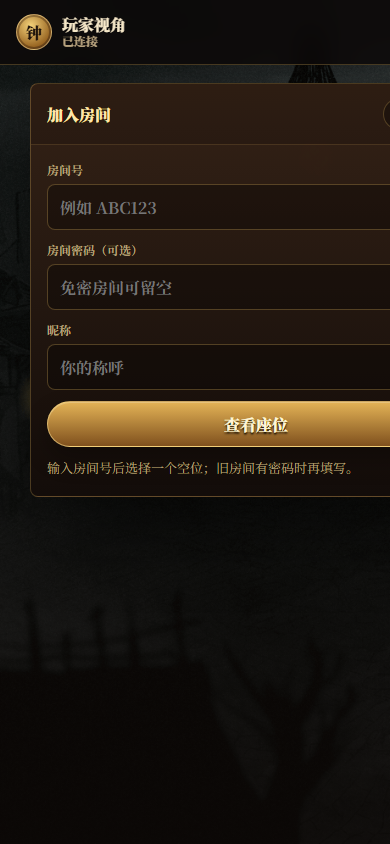

# BOTC AI Storyteller Assistant

> Unofficial local-first storyteller assistant for **Blood on the Clocktower**.
> 非官方《血染钟楼》本地说书人辅助工具：开房、座位、发身份、夜晚候选、投票和复盘，都集中在一个浏览器工作台里。

[](LICENSE)
[](https://nodejs.org/)
[](#quick-start)
[](#roadmap)
[](#legal--ip-notice)

<p align="center">
  
</p>

<p align="center">
  
</p>

## What is this?

This project is a **local-first storyteller operating desk** for Blood on the Clocktower games.

It is designed for in-person or LAN groups that want one browser tool to manage:

- storyteller room creation and player seating;
- script selection, setup, and identity deal flow;
- private player identity delivery on phones;
- night order, player submissions, and storyteller-reviewed candidates;
- nominations, votes, executions, day/night flow, and game-end review;
- imported/community scripts with manual review boundaries.

**It is not an official TPI product, not a replacement for the official app, and not a fully autonomous rules engine.**
AI and rule automation only produce drafts/candidates. Any action that changes authoritative game state remains behind storyteller confirmation.

## 为什么做这个？

《血染钟楼》好玩，但说书人的操作负担很重：座位、发身份、首夜顺序、恶魔伪装、玩家私密信息、提名投票、死亡状态、断线重连、复杂角色判定都会同时挤到说书人面前。

这个项目的目标不是替代说书人，而是把重复操作和信息整理交给工具，让说书人保留最终裁决权：

> **AI 只起草，规则只建议，说书人最终确认。**

## Highlights / 核心功能

| Area | What it does |
| --- | --- |
| Storyteller desk | Grimoire-style browser UI, room creation, seating, state panel, night/day workflow |
| Player mobile view | Join by room code, claim seat, receive identity, read private/public information |
| Setup and deal | Generate setup candidates, confirm setup, send identities, lock setup after deal |
| Night flow | Night order, role prompts, player submissions, candidate review, manual ruling gates |
| Day and voting | Nomination, vote tracking, execution confirmation, day/night transition support |
| Script support | Trouble Brewing, Bad Moon Rising, Sects & Violets, Catfishing, and reviewed imports |
| AI boundary | AI produces draft candidates only; state changes require storyteller confirmation |
| Local-first runtime | Runs on one computer; phones/tablets join through LAN URL |

## Screenshots

More screenshots and notes: [docs/SCREENSHOTS.md](docs/SCREENSHOTS.md)

| Storyteller desktop | Player mobile |
| --- | --- |
|  |  |

## Quick start

Requirements:

- Node.js 18+
- npm

```bash
npm install
# npm install runs the optional icon downloader. If it was skipped or failed:
npm run assets:icons
npm start
```

Open:

- Storyteller: `http://localhost:3000/storyteller-v2.html`
- Player: `http://localhost:3000/player-v2.html`

For LAN play, open the storyteller page on the host computer and let players join the player URL through the host machine's LAN IP.

## Role icons and third-party assets

Role icons are **not committed** to this repository. They can be downloaded into a local gitignored runtime cache:

```bash
npm run assets:icons
```

Downloaded files are written to `public/clocktower-assets/role_icon/`. They are not covered by this project's MIT License. See [Third-party notices](docs/THIRD_PARTY_NOTICES.md).

## Core workflow

```mermaid
flowchart LR
  A[Create room] --> B[Players join and claim seats]
  B --> C[Select script]
  C --> D[Generate setup candidate]
  D --> E[Storyteller confirms setup]
  E --> F[Deal identities]
  F --> G[Night order and submissions]
  G --> H[Storyteller confirms results]
  H --> I[Day nominations and votes]
  I --> J[Execution / no execution]
  J --> K[Next night or game review]
```



## Project docs

- [Project overview / 项目说明书](docs/PROJECT_OVERVIEW.md)
- [Feature guide / 核心功能说明](docs/FEATURES.md)
- [Screenshots](docs/SCREENSHOTS.md)
- [GitHub profile copy](docs/GITHUB_PROFILE_COPY.md)
- [Third-party notices](docs/THIRD_PARTY_NOTICES.md)

## Iteration history

The public repo represents an ongoing personal/fan-tool iteration from **November 2025 to July 2026**.

| Time | Milestone |
| --- | --- |
| 2025-11 | Started from offline storyteller pain points: seating, setup, identity delivery, and night flow notes |
| 2025-12 | Built early browser prototypes and local room/player concepts |
| 2026-01 | Moved toward Node.js + Express + WebSocket runtime |
| 2026-03 | Expanded visual grimoire UI and player mobile entry flow |
| 2026-05 | Added MVP game loop: setup/deal, night/day flow, voting, review boundaries |
| 2026-06 | Clarified AI as draft-only assistant; added stronger storyteller confirmation gates |
| 2026-07 | Prepared public package: docs, screenshots, legal notice, privacy cleanup, generated icon cache, and GitHub-facing README |

## Project structure

```text
.
|-- server.js                  # Express + WebSocket runtime
|-- public/                    # Storyteller/player browser UI and static assets
|   |-- storyteller-v2.html
|   |-- player-v2.html
|   `-- clocktower-assets/     # Runtime UI assets; role icons download into a gitignored cache
|-- modules/                   # Game/domain modules
|-- data/                      # Runtime data, scripts, and knowledge files
|-- scripts/                   # Local start, icon download, and public-package verification scripts
|-- docs/                      # Project overview, feature guide, screenshots, notices
|-- Dockerfile
|-- docker-compose.yml
`-- package.json
```

## Verification

```bash
npm run verify:public-package
```

The verification script starts a local server, checks the storyteller/player pages, validates key data paths, and prints `PUBLIC_PREFLIGHT_GO` when the public package is runnable.

## Roadmap

- Broader real-table playtesting.
- Cleaner custom script import/review workflow.
- More structured rules-candidate explanations.
- More screenshots and short demo videos.
- Keep role icons as a generated/downloaded local cache instead of committing them to the repo.
- Stronger separation between source code license and third-party/game IP assets.

## Legal & IP notice

### Acknowledgements

- [The Pandemonium Institute](https://bloodontheclocktower.com/) — Creators of Blood on the Clocktower.
- [botc-icons](https://github.com/tomozbot/botc-icons) — Role icons may be downloaded at install/build time for local use in this unofficial fan tool. Downloaded icon files are written to `public/clocktower-assets/role_icon/`, which is gitignored. These icon/art assets remain the copyright of their respective artists and owners; they are **not** covered by this project's MIT license, and this project claims no rights to them.
- Blood on the Clocktower community script authors and unofficial tool builders whose public work helped shape this fan-tool pattern.

### License

This project is licensed under the [MIT License](LICENSE). See also [Third-party notices](docs/THIRD_PARTY_NOTICES.md).

This project's MIT license covers only its own source code and documentation — it grants no rights to any Blood on the Clocktower intellectual property. Character names, ability text, role icons, and associated artwork remain the property of their respective owners.

### Disclaimer

This is an unofficial, fan-made tool, created and distributed free of charge. It is not affiliated with, endorsed by, sponsored by, or licensed by The Pandemonium Institute.

Blood on the Clocktower, its characters, and its associated names and artwork are the property of Steven Medway and The Pandemonium Institute. This project claims no ownership over Blood on the Clocktower intellectual property.