# BOTC AI Storyteller Assistant

> Unofficial AI-assisted storyteller co-pilot for **Blood on the Clocktower**.
> 非官方《血染钟楼》AI 说书人副驾驶：开房、座位、发身份、AI 审阅夜晚技能结算候选、风险提示、投票和复盘，都集中在一个浏览器工作台里。

[](LICENSE)
[](https://nodejs.org/)
[](#quick-start)
[](#roadmap)
[](#legal--ip-notice)

<p align="center">
  
</p>

## What is this?

This project is a **local-first AI storyteller co-pilot** for Blood on the Clocktower games.

It is designed for in-person or LAN groups that want one browser tool to manage:

- storyteller room creation and player seating;
- script selection, setup, and identity deal flow;
- private player identity delivery on phones;
- night order, player submissions, rule-assisted skill result candidates, AI review notes, and storyteller-reviewed settlement;
- nominations, votes, executions, day/night flow, and game-end review;
- imported/community scripts with manual review boundaries.

**It is not an official TPI product, not a replacement for the official app, and not a fully autonomous rules engine.**
AI is a first-class co-pilot here: it can review rule-generated settlement candidates, draft confirmation copy, summarize risk points, drive AI test players for demos/stress tests, and keep an audit trail. It still does not become the final judge. Any action that changes authoritative game state remains behind storyteller confirmation.

## 为什么做这个？

《血染钟楼》好玩，但说书人的操作负担很重：座位、发身份、首夜顺序、恶魔伪装、玩家私密信息、提名投票、死亡状态、断线重连、复杂角色判定都会同时挤到说书人面前。

这个项目的目标不是替代说书人，而是把重复操作和信息整理交给工具，让说书人保留最终裁决权：

> **AI 只起草，规则只建议，说书人最终确认。**

## AI co-pilot capabilities / AI 核心能力

This project is not just a digital grimoire. The AI layer is designed as a **storyteller co-pilot**:

| AI capability | What it does | Safety boundary |
| --- | --- | --- |
| AI-reviewed night settlement | Sends redacted rule-generated candidates to an OpenAI-compatible provider and asks for storyteller-facing `copySuggestion` and `riskSummary` | AI output is draft-only; it is not sent to players and does not mutate state |
| Risk and edge-case reminder | Highlights possible rule/leakage risks before the storyteller confirms a result | Storyteller can edit, reject, or use manual ruling |
| AI test players | Fills empty seats, auto-confirms identity receipts, submits deterministic night actions, and supports demo/stress flows | Marked as test-player behavior, not a real-player replacement |
| Strategy explorer | Generates suggested night targets, nominations, nominators, and votes based on alignment, survival, role profile, and history | Suggestion-only through existing player/storyteller commands |
| Safe AI control mode | Auto mode can refresh suggestions or summarize storyteller state | High-risk intents such as deal roles, confirm results, send private messages, write logs, or mutate state are blocked |
| Audit trail | Records provider metadata, redaction summary, downgrade reason, and whether model output was used | Server-side secrets only; player-visible output remains false until storyteller confirmation |

In short:

```text
AI = co-pilot for review, risk notes, strategy simulation, and draft wording
Storyteller = final authority for confirmation, rulings, messages, and state changes
```

## Screenshots / Core feature demo / 核心功能演示

More screenshots, generation notes, and coverage map: [docs/SCREENSHOTS.md](docs/SCREENSHOTS.md)

### Animated overview / GIF 总览

<p align="center">
  
</p>

### Full core flow / 完整核心流程截图

| Welcome | Main menu |
| --- | --- |
|  |  |

| Player seat select | Player waiting room |
| --- | --- |
|  |  |

| Storyteller room lobby | Script switch |
| --- | --- |
|  |  |

| Setup candidate | Deal confirmation |
| --- | --- |
|  |  |

| Player identity receipt | Night flow |
| --- | --- |
|  |  |

| Day vote | Role library |
| --- | --- |
|  |  |

| Private message | Manual storyteller tool |
| --- | --- |
|  |  |

| History log | Game review |
| --- | --- |
|  |  |

| AI boundary |
| --- |
|  |

## Highlights / 核心功能

| Area | What it does |
| --- | --- |
| AI storyteller co-pilot | Model-assisted candidate review, risk summaries, draft confirmation copy, AI test players, and safe suggestion mode |
| Storyteller desk | Grimoire-style browser UI, room creation, seating, state panel, night/day workflow |
| Player mobile view | Join by room code, claim seat, receive identity, read private/public information |
| Setup and deal | Generate setup candidates, confirm setup, send identities, lock setup after deal |
| Night skill settlement | Night order, role prompts, player submissions, rule result candidates, AI review notes, storyteller review, manual ruling gates |
| Day and voting | Nomination, vote tracking, execution confirmation, day/night transition support |
| Role library | Built-in role reference panel with script tabs and local ability-note edits |
| Rule/AI boundary | Rule automation and AI produce settlement drafts, risk notes, and strategy suggestions only; state changes require storyteller confirmation |
| Script support | Trouble Brewing, Bad Moon Rising, Sects & Violets, Catfishing, and reviewed imports |
| Local-first runtime | Runs on one computer; phones/tablets join through LAN URL |

## Quick start

Requirements:

- Node.js 18+
- npm

```bash
npm install
# npm install runs the optional icon downloader. If it was skipped or failed:
npm run assets:icons
npm start
```

Open:

- Storyteller: `http://localhost:3000/storyteller-v2.html`
- Player: `http://localhost:3000/player-v2.html`

For LAN play, open the storyteller page on the host computer and let players join the player URL through the host machine's LAN IP.

## Role icons and third-party assets

Role icons are **not committed** to this repository. They can be downloaded into a local gitignored runtime cache:

```bash
npm run assets:icons
```

Downloaded files are written to `public/clocktower-assets/role_icon/`. They are not covered by this project's MIT License. See [Third-party notices](docs/THIRD_PARTY_NOTICES.md).

## Core workflow

```mermaid
flowchart LR
  A[Create room] --> B[Players join and claim seats]
  B --> C[Select script]
  C --> D[Generate setup candidate]
  D --> E[Storyteller confirms setup]
  E --> F[Deal identities]
  F --> G[Night order and submissions]
  G --> H[Generate skill result candidates]
  H --> I[Storyteller confirms / edits settlement]
  I --> J[Day nominations and votes]
  J --> K[Execution / no execution]
  K --> L[Next night or game review]
```



## Project docs

- [Project overview / 项目说明书](docs/PROJECT_OVERVIEW.md)
- [AI capabilities / AI 能力说明](docs/AI_CAPABILITIES.md)
- [Feature guide / 核心功能说明](docs/FEATURES.md)
- [Screenshots](docs/SCREENSHOTS.md)
- [Human changelog / 给非开发者看的迭代日志](docs/HUMAN_CHANGELOG.md)
- [GitHub profile copy](docs/GITHUB_PROFILE_COPY.md)
- [Third-party notices](docs/THIRD_PARTY_NOTICES.md)

## Iteration history

The public repo represents an ongoing personal/fan-tool iteration from **November 2025 to July 2026**.

| Time | Milestone |
| --- | --- |
| 2025-11 | Started from offline storyteller pain points: seating, setup, identity delivery, and night flow notes |
| 2025-12 | Built early browser prototypes and local room/player concepts |
| 2026-01 | Moved toward Node.js + Express + WebSocket runtime |
| 2026-03 | Expanded visual grimoire UI and player mobile entry flow |
| 2026-05 | Added MVP game loop: setup/deal, night/day flow, voting, review boundaries |
| 2026-06 | Clarified AI as draft-only co-pilot; added provider review, audit boundary, and stronger storyteller confirmation gates |
| 2026-07 | Prepared public package: docs, screenshots, legal notice, privacy cleanup, generated icon cache, and GitHub-facing README |

## Project structure

```text
.
|-- server.js                  # Express + WebSocket runtime
|-- public/                    # Storyteller/player browser UI and static assets
|   |-- storyteller-v2.html
|   |-- player-v2.html
|   `-- clocktower-assets/     # Runtime UI assets; role icons download into a gitignored cache
|-- modules/                   # Game/domain modules
|-- data/                      # Runtime data, scripts, and knowledge files
|-- scripts/                   # Local start, icon download, and public-package verification scripts
|-- docs/                      # Project overview, feature guide, screenshots, notices
|-- Dockerfile
|-- docker-compose.yml
`-- package.json
```

## Verification

```bash
npm run verify:public-package
```

The verification script starts a local server, checks the storyteller/player pages, validates key data paths, and prints `PUBLIC_PREFLIGHT_GO` when the public package is runnable.

## Roadmap

- Broader real-table playtesting.
- Cleaner custom script import/review workflow.
- Stronger AI co-pilot explanations: why a result candidate was generated, what AI flagged, what must still be confirmed, and which edge cases need manual ruling.
- More screenshots and short demo videos.
- Keep role icons as a generated/downloaded local cache instead of committing them to the repo.
- Stronger separation between source code license and third-party/game IP assets.

## Legal & IP notice

### Acknowledgements

- [The Pandemonium Institute](https://bloodontheclocktower.com/) — Creators of Blood on the Clocktower.
- [botc-icons](https://github.com/tomozbot/botc-icons) — Role icons may be downloaded at install/build time for local use in this unofficial fan tool. Downloaded icon files are written to `public/clocktower-assets/role_icon/`, which is gitignored. These icon/art assets remain the copyright of their respective artists and owners; they are **not** covered by this project's MIT license, and this project claims no rights to them.
- Blood on the Clocktower community script authors and unofficial tool builders whose public work helped shape this fan-tool pattern.

### License

This project is licensed under the [MIT License](LICENSE). See also [Third-party notices](docs/THIRD_PARTY_NOTICES.md).

This project's MIT license covers only its own source code and documentation — it grants no rights to any Blood on the Clocktower intellectual property. Character names, ability text, role icons, and associated artwork remain the property of their respective owners.

### Disclaimer

This is an unofficial, fan-made tool, created and distributed free of charge. It is not affiliated with, endorsed by, sponsored by, or licensed by The Pandemonium Institute.

Blood on the Clocktower, its characters, and its associated names and artwork are the property of Steven Medway and The Pandemonium Institute. This project claims no ownership over Blood on the Clocktower intellectual property.
